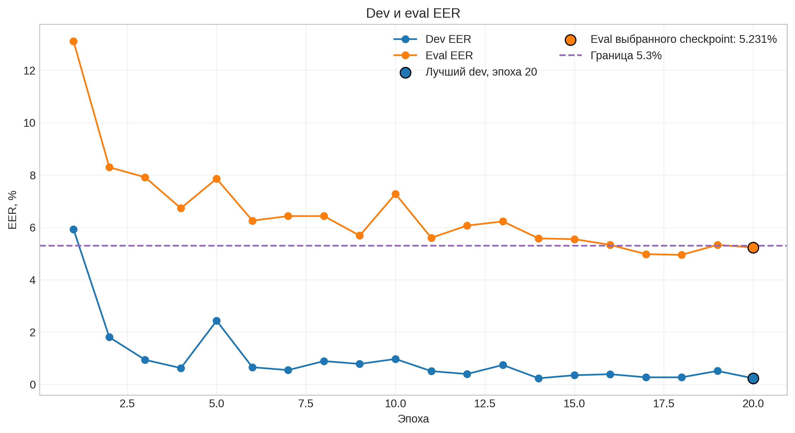
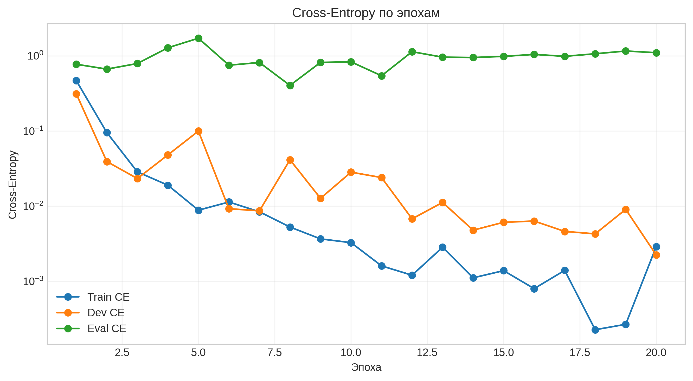
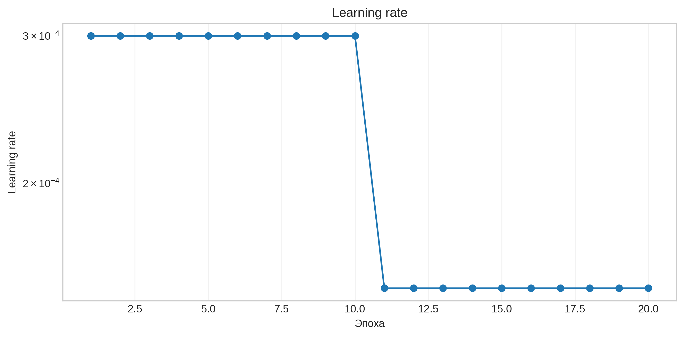
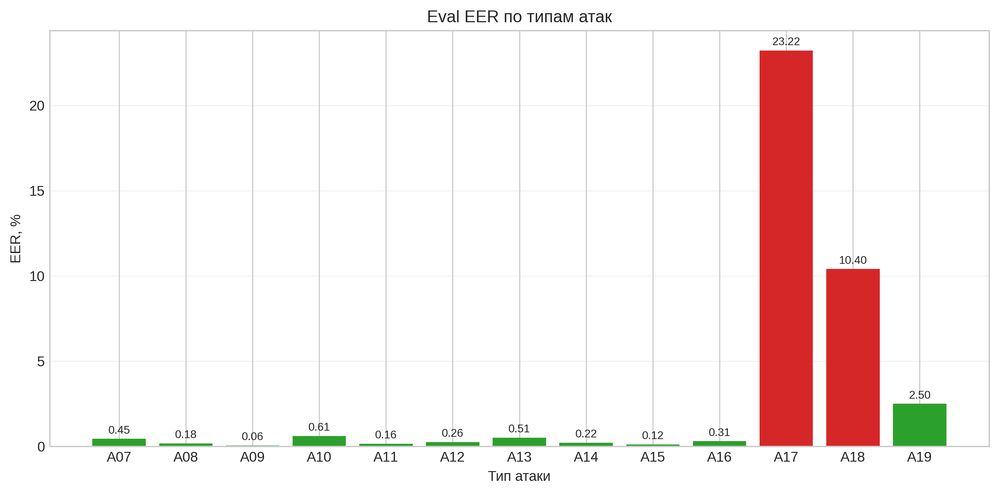

# LFCC-LCNN для Voice Anti-spoofing

Проект решает задачу обнаружения синтезированной и преобразованной речи на Logical Access части [ASVspoof 2019](https://datashare.ed.ac.uk/handle/10283/3336). Разделы и типы атак определяются официальным [evaluation plan](https://www.asvspoof.org/asvspoof2019/asvspoof2019_evaluation_plan.pdf)

Финальная модель: `LFCC + LCNN + Cross-Entropy`. Обучение выполнено на PyTorch в Kaggle

Материалы:

- [финальный Kaggle-ноутбук](./hm-dl.ipynb)
- [W&B Report с графиками](https://wandb.ai/putinsevav-hse-university/voice-antispoofing/reports/-LFCC-LCNN---VmlldzoxNzU1ODg5MQ?accessToken=h9iiiip7445lho3x9jswhjrqlpx5mq4jft6g58hagw882rkeepfvp82fowb6xdc6)

## Постановка задачи и метрика

ASVspoof 2019 LA содержит настоящие записи `bonafide` и записи, созданные разными алгоритмами синтеза и преобразования голоса `spoof`. Модель получает аудиофайл и возвращает непрерывный score:

```text
score = bonafide_logit - spoof_logit
```

Чем выше score, тем больше модель уверена, что речь настоящая. В submission записывается именно непрерывный score, а не предсказанный класс

Основная метрика - EER, точка, в которой доля пропущенных spoof-записей равна доле ошибочно отклонённых bonafide-записей. Чем меньше EER, тем лучше

## Методика

### Подготовка признаков

В качестве front-end выбран LFCC. Он всё равно начинается со STFT, поэтому исходный сигнал сначала переводится в частотно-временное представление. Затем применяются линейный банк фильтров, логарифм и DCT. К 20 статическим коэффициентам добавляются delta и delta-delta, поэтому на каждом временном шаге получается 60 признаков.

Параметры LFCC:

| Параметр | Значение |
| --- | ---: |
| Sample rate | 16 000 Гц |
| Окно | 320 отсчётов, 20 мс |
| Шаг | 160 отсчётов, 10 мс |
| FFT | 512 |
| Линейных фильтров | 20 |
| LFCC | 20 + delta + delta-delta |
| Итоговое число признаков | 60 |
| Число временных кадров | 750 |

На train используется случайный crop до 750 кадров. На dev и eval берётся центральный crop. Короткие записи дополняются обычными нулями. Это оказалось важно т.к padding значением `log(1e-12)` создавал слишком контрастную искусственную область и ухудшал перенос на eval в предыдуших прогонах

### Архитектура LCNN

Основной блок - MFM. Свёртка создаёт в два раза больше каналов, после чего MFM делит их пополам и оставляет поэлементный максимум, т.е сеть одновременно выбирает более полезные признаки и уменьшает число каналов

В модели используются обычные свёртки, NIN-слои `1x1`, MFM, MaxPool и BatchNorm. После свёрточной части получается embedding размерности 80. Так же деалем `Dropout(p=0.25)` перед финальным `BatchNorm1d`

```text
waveform [L]
  -> STFT power [257, T]
  -> linear filter bank + log + DCT [20, T]
  -> static + delta + delta-delta [60, T]
  -> crop/pad [1, 60, 750]
  -> LCNN [B, 32, 3, 46]
  -> embedding [B, 80]
  -> logits [spoof, bonafide]
  -> continuous score
```

Модель содержит `864 290` обучаемых параметров

### Почему LFCC и Cross-Entropy

Рекомендации по подготовке данных и обучению взяты из сравнительной [работы Wang и Yamagishi](https://arxiv.org/abs/2103.11326). В ней LFCC оказался устойчивым front-end для LCNN на разных запусках. Линейная частотная шкала также не сжимает высокочастотную область так сильно, как mel-шкала, поэтому в признаках могут сохраниться артефакты синтеза

Для двух классов оставлена обычная Cross-Entropy. A-Softmax вводит угловой margin и требует отдельно подбирать его параметры и масштаб logits. Это может улучшать разделимость embedding, но делает обучение чувствительнее к настройкам. Дополнительный эксперимент с P2SGrad тоже не дал улучшения, поэтому усложнять функцию потерь не стала

## Экспериментальная настройка

Используются официальные train, dev и eval протоколы ASVspoof 2019 LA:

- train участвует в обновлении весов
- dev используется для выбора `best.pt`
- eval считается после каждой эпохи для графика и итоговой оценки, но не участвует в выборе checkpoint

При этом условие сохранения лучшей модели зависит только от dev EER, а при равном dev EER от dev loss

Основные параметры полного запуска:

| Параметр | Значение |
| --- | ---: |
| Seed | 42 |
| Epochs | 20 |
| Train batch size | 64 |
| Eval batch size | 128 |
| Optimizer | Adam |
| Learning rate | `3e-4` |
| Scheduler | StepLR |
| Step size | 10 эпох |
| Gamma | 0.5 |
| Loss | Cross-Entropy |
| Dropout | 0.25 |
| Train AMP | включён |
| Dev/eval AMP | выключен |

До полного обучения был выполнен one-batch test. Один batch с двумя классами использовался одновременно как train и dev. Модель смогла довести EER на нём до `0%`, поэтому после этого был запущен полный датасет

## Проведённые эксперименты

Работу я начала с единого Kaggle-ноутбука. В нём последовательно находились подготовка данных, построение признаков, описание модели, обучение и inference. Такой формат был удобен на этапе первых экспериментов, т.к можно было по ячейкам проверять пути к данным, размеры тензоров, вид входных признаков и результат каждого изменения

После выбора LFCC-LCNN с Cross-Entropy я перенесла решение в модульный PyTorch-проект, отдельно вынесла конфигурации, Dataset, преобразование LFCC, модель, Trainer, метрики, W&B-логирование и работу с checkpoints. Финальный Kaggle-ноутбук уже не содержит отдельную копию модели, а клонирует проект с GitHub и последовательно запускает one-batch test, полное обучение, inference, проверку CSV и построение графиков

Модель улучшалась последовательно, по одному основному изменению за запуск:

| Эксперимент | Формат | Eval EER | Результат по шкале задания | Что изменилось |
| --- | --- | ---: | ---: | --- |
| STFT-LCNN + CE, padding значением `log_eps` | единый Kaggle-ноутбук | 10.3323% | 2.81 | первый baseline |
| STFT-LCNN + P2SGrad | единый Kaggle-ноутбук | 14.1531% | 0.00 | заменена функция потерь |
| STFT-LCNN + CE, zero-padding | единый Kaggle-ноутбук | 8.5396% | 5.37 | исправлен padding |
| LFCC-LCNN + CE, первый запуск | единый Kaggle-ноутбук | 5.7243% | 9.39 | STFT-признаки заменены на LFCC |
| LFCC-LCNN + CE, финальный запуск | PyTorch-проект, запущенный из Kaggle | **5.2315%** | **10.00** | 20 эпох и финальная проверка pipeline |

Первый запуск показал, что почти нулевой dev EER ещё не означает хороший результат на eval. В eval находятся неизвестные модели атак, поэтому этот раздел заметно сложнее. Замена padding снизила eval EER с `10.33%` до `8.54%`

P2SGrad ухудшил eval EER до `14.15%`, поэтому после этого прогона я зафиксировала Cross-Entropy, а основным изменением стал переход на LFCC. Первый LFCC-запуск дал `5.72%`, а финальный запуск проекта- `5.23%`. Checkpoint `best.pt` выбирался только по dev EER, без использования eval EER, поэтому eval не влиял на выбор весов модели

## Финальные результаты

`best.pt` выбран на 20-й эпохе только по dev:

| Метрика | Значение |
| --- | ---: |
| Эпоха checkpoint | 20 |
| Dev EER | 0.2366% |
| Eval EER | **5.2315%** |
| EER threshold | 9.038194 |
| Train CE | 0.00290 |
| Dev CE | 0.00224 |
| Eval CE | 1.09795 |
| Файлов в eval | 71 237 |
| Уникальных scores | 71 024 |


### Dev и eval EER



Dev EER быстро снизился и дальше колебался на небольших значениях. Eval EER тоже менялся не монотонно, но общий тренд направлен вниз (содержат разные атаки поэтому довольно логичное движение на графиках)

Минимальный eval EER на графике встречается раньше, но он не использовался для выбора модели(выбор был по dev eer)

### Cross-Entropy



Train и dev loss в целом уменьшались. Eval loss оставался намного выше и мог расти, хотя EER становился лучше. Для нашей задачи это нормально т.к Cross-Entropy зависит от абсолютной величины и калибровки logits, а EER определяется разделением и порядком scores. Поэтому loss используется для оптимизации и контроля обучения, но итоговое качество сравнивается по EER

### Learning rate



Первые 10 эпох использовался learning rate `3e-4`. После шага StepLR он уменьшился до `1.5e-4`. Это позволило продолжить обучение с более аккуратными обновлениями весов

### EER по типам атак



Для атак A07-A16 EER оказался ниже `1%`. Самыми сложными остались A17 и A18: `23.22%` и `10.40%`. Для A19 получено `2.50%`. Поэтому итоговый EER в основном определяется несколькими наиболее сложными неизвестными атаками, а не одинаковым числом ошибок на всех типах

## С какими трудностями я столкнулась

Во время работы возникло несколько проблем:

- почти нулевой dev EER сначала выглядел подозрительно, но eval показал, что это не утечка, а заметная разница между известными и неизвестными атаками
- padding после логарифмирования создавал искусственную полосу в признаках, поэтому он был заменён на обычные нули
- P2SGrad теоретически выглядел интересно, но на этом pipeline ухудшил результат
- полный eval содержит 71 237 файлов и выполняется после каждой эпохи, поэтому одна эпоха стала намного дольше(т.к приходилось логировать все)

Чтобы не терять обучение при сбросе Kaggle, после каждой эпохи сохраняется `last.pt`, при улучшении dev - `best.pt`, а каждые пять эпох - `epoch_NNN.pt`. Checkpoint содержит модель, optimizer, scheduler, AMP scaler, номер эпохи, историю метрик и W&B run ID

## Структура проекта

Проект организован по модульной схеме PyTorch Project Template: конфигурация, Dataset, модель, Trainer, метрики и логирование разделены по папкам

```text
hw_dl/
|-- src/
|   |-- configs/          # Hydra-конфигурации
|   |-- datasets/         # протокол и Dataset
|   |-- logger/           # логирование в W&B
|   |-- metrics/          # вычисление EER
|   |-- model/            # LCNN и MFM
|   |-- trainer/          # обучение и inference
|   |-- transforms/       # LFCC
|   `-- utils/            # seed, checkpoint и submission
|-- report_figures/       # графики для отчёта
|-- train.py
|-- inference.py
|-- plot_report.py
|-- hm-dl.ipynb            # последовательный запуск проекта в Kaggle
|-- grading.py
`-- ASVspoof2019.LA.cm.eval.trl.txt
```

## Установка

```bash
python -m venv .venv

# Windows PowerShell
.\.venv\Scripts\Activate.ps1

# Windows cmd
.venv\Scripts\activate.bat

# Linux/macOS
source .venv/bin/activate

python -m pip install --upgrade pip
pip install -r requirements.txt
```

В Kaggle PyTorch уже установлен, поэтому его не нужно переустанавливать:

```python
%cd /kaggle/working
!git clone --branch main https://github.com/vputt/hw_dl.git
%cd /kaggle/working/hw_dl
!pip install -q -r requirements-kaggle.txt
```

Датасет подключается как Kaggle Input. Использованный путь:

```python
DATA_ROOT = "/kaggle/input/datasets/awsaf49/asvpoof-2019-dataset/LA/LA"
```

Каталог должен иметь структуру:

```text
LA/LA/
|-- ASVspoof2019_LA_cm_protocols/
|   |-- ASVspoof2019.LA.cm.train.trn.txt
|   |-- ASVspoof2019.LA.cm.dev.trl.txt
|   `-- ASVspoof2019.LA.cm.eval.trl.txt
|-- ASVspoof2019_LA_train/flac/
|-- ASVspoof2019_LA_dev/flac/
`-- ASVspoof2019_LA_eval/flac/
```

Для W&B ключ добавляется в Kaggle Secrets под именем `WANDB_API_KEY`:

```python
import os
from kaggle_secrets import UserSecretsClient

os.environ["WANDB_API_KEY"] = UserSecretsClient().get_secret("WANDB_API_KEY")
```

## Запуск

### One-batch test

```bash
python train.py \
  data.root=/path/to/LA/LA \
  data.num_workers=0 \
  debug.overfit_one_batch=true \
  trainer.monitor_eval=false \
  trainer.epochs=100 \
  scheduler.step_size=1000 \
  trainer.output_dir=outputs/one_batch \
  wandb.enabled=false
```

### Полное обучение

```bash
python train.py \
  data.root=/path/to/LA/LA \
  trainer.output_dir=outputs/lfcc_lcnn_ce_seed42
```

Продолжение с `last.pt`:

```bash
python train.py \
  data.root=/path/to/LA/LA \
  trainer.output_dir=outputs/lfcc_lcnn_ce_seed42 \
  trainer.resume_from=outputs/lfcc_lcnn_ce_seed42/last.pt
```

### Inference и CSV

```bash
python inference.py \
  data.root=/path/to/LA/LA \
  inference.checkpoint=outputs/lfcc_lcnn_ce_seed42/best.pt \
  inference.output_path=vaputintseva.csv \
  inference.per_attack_output=vaputintseva_per_attack_eer.csv \
  inference.compute_eer=true
```

`inference.py` проходит eval в порядке официального protocol-файла и записывает 71 237 непрерывных scores без header. Формат затем проверяется выданным `grading.py`.

После этого запускается выданный `grading.py`:

```bash
mkdir -p students_solutions
cp vaputintseva.csv students_solutions/vaputintseva.csv
python grading.py
```
(тут уже сразу мой логин почты вставлен)

### Построение графиков

История W&B экспортируется в `wandb_export_ufl4kmup.csv` ячейкой из финального ноутбука. Затем:

```bash
python plot_report.py \
  --history wandb_export_ufl4kmup.csv \
  --per-attack vaputintseva_per_attack_eer.csv \
  --output-dir report_figures
```

Скрипт сохраняет графики в PNG и PDF.

## Вывод

В работе была реализована полная система voice anti-spoofing: чтение официальных протоколов, построение LFCC, LCNN с MFM, обучение, подсчёт EER, W&B-логирование, checkpoints и формирование submission.

Последовательные эксперименты показали, что хороший dev EER сам по себе не гарантирует перенос на неизвестные атаки. Наибольший вклад в улучшение дали корректный zero-padding и переход со спектрограммы на LFCC. Финальная модель получила `eval EER = 5.2315%`.
